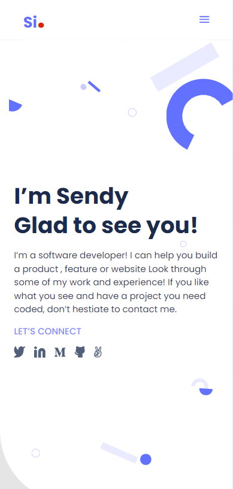

# Si. Port-Folio

> This project objective is to understand how to build a portfolio, which is one of the most powerful tools in our software developer toolbox; it's the simplest way of demonstrating what we're truly capable of as developers, and it's a quick and easy way for recruiters and hiring managers to get an idea of what we can bring to their teams.

## Description

### Mobile version Screenshot:

### Desktop version Screenshot:

### Objective

This project's goals are as follows:

- Learn how to interpret a Figma design to generate a user interface.
- A flexbox is used to position components on the page.
- Build a personal responsive portfolio site.
- Use photos and backdrops to improve the appearance of the website.
- Use HTML5 validations to build forms.
- Recognize the significance of user experience.
- Learn how to use media queries to develop UIs that adapt to different screen sizes.

## Built With

- HTML, CSS, Javascript (Vanilla)

## Getting Started

This is a simple PortFolio which shows all my Projects and Accomplishments. The structure behind this nice work is as is on this repository. Do well to give a star 🌟 as we sort 🚀 higher together and make the society a better place with our skills and stacks.

### Prerequisites

Basic prequisites for opening a webpage as is required.

- A standard PC or Mac with -
- Compatible and up to data browser both for PC and mobile.

### Usage

This code can be used for educational 📘 and code viewing purposed. The copying of these code for other use would be liable to plagarism and practically and developmentally unaccceptable.

## Authors

👤 **Sendy Inieke - Si.**

- GitHub: [@uisendy](https://github.com/uisendy)
- Twitter: [@SInieke](https://twitter.com/SInieke)

## 🤝 Contributing

Contributions, issues, and feature requests are welcome!

If you find any bug or suggestion for improvement please Feel free to check the [issues page](../../issues/) with your proposed change.

## Show your support

Give a ⭐️ if you like this project!

## Acknowledgments

- Hat tip to  is where you Gain skills you need to get hired. Learn Online and connect to life changing opportunities. [Apply today](https://www.microverse.org/?grsf=uv064g)

## Update info

The last update was the design of the Contact-me Section | Rev📅: 05:07:2022 | More to come. 🚀🚀🚀

## 📝 License

This project is [MIT](./MIT.md) licensed.
